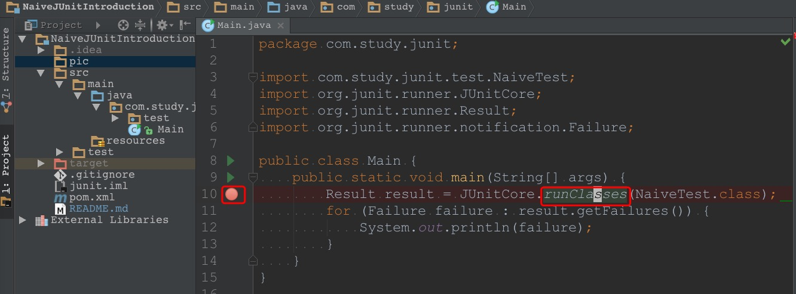

# 参考文章
1. [JUnit源码解析](https://blog.saymagic.cn/android/2016/09/30/understand-Junit.html)
2. [Junit源码阅读笔记一(从JunitCore开始)](https://www.jianshu.com/p/205946b4aa20)
3. [Junit源码阅读笔记二(Runner构建)
](https://www.jianshu.com/p/4825a350477b)
4. [Junit源码阅读笔记三(TestClass)
](https://www.jianshu.com/p/bc93eee11a18)

**以上链接对应的文章都是他人的劳动成果**

# 为什么写成这种风格
源码中的很多概念是抽象的, 
看多了容易觉得乏味, 
而且源码中的逻辑经常会跳转多次,
如果不得要领的话,
很容易产生"我在哪里?我要做什么?"的困惑.

不如我们自己给自己找点乐趣,
用章回小说来模拟读源码的过程,
把源码里那些重要的类看成小说里的角色.
这样读下来,
也许会印象深刻一点.

# 带着问题去阅读
正文开始之前,
我们可以先提几个问题,
带着问题去阅读,
也许效率会高一点
1. `@Test` 是在源码的哪个地方被解析的?
2. `@Test` 修饰的方法必须是无参数的方法,这个校验是在哪里做的?
3. 测试类必须是 `public` 的且刚好有一个无参构造函数,这个校验是哪里做的?
4. `@Before` 是如何被支持的?
5. `@BeforeClass` 是如何被支持的?
6. `@RunWith` 是如何被支持的?

# 准备工作
## `Maven` 配置
我使用的 `JUnit` 版本为 `4.12`，对应的 `maven` 配置如下
```xml
<dependency>
    <groupId>junit</groupId>
    <artifactId>junit</artifactId>
    <version>4.12</version>
</dependency>
```

## `JUnit` 的入口
[参考文章[1]](https://blog.saymagic.cn/android/2016/09/30/understand-Junit.html) 中提到 `JUnit` 的入口为 `JUnitCore` 类中的 `runClasses(Class<?>... classes)` 方法.
我们可以写个 [简单的类](src/main/java/com/study/junit/Main.java),
在其 `main` 函数中调用 `JUnitCore.runClasses(...)` 方法, 
然后就可以打断点来探索里面的逻辑了. 
`main` 函数的代码如下
```java
public static void main(String[] args) {
  Result result = JUnitCore.runClasses(NaiveTest.class);
  for (Failure failure : result.getFailures()) {
    System.out.println(failure);
  }
}
```
断点的位置如下图所示


那就从这个断点开始我们的旅程吧.

1. [第一回 初窥门径](chap1.md)
2. [第二回 `Runner`全家桶](chap2.md)
3. [第三回 五兄弟同心造`Runner`](chap3.md)
