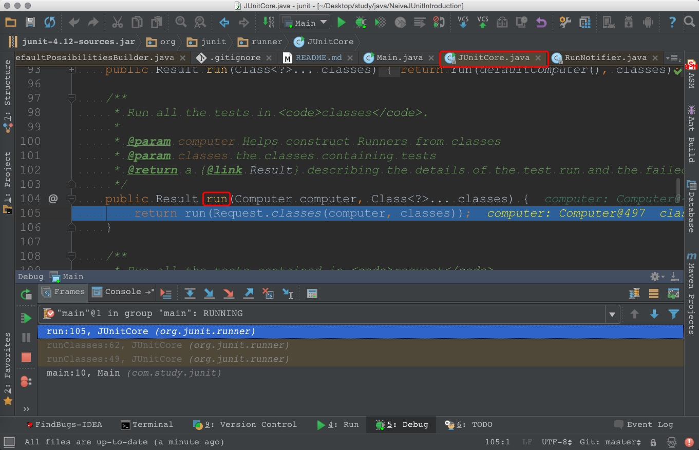

# 第一回 初窥门径


我们在上图位置打个断点,
经过几次简单的跳转后, 
就会来到 `JUnitCore` 类的 `run(Computer computer, Class<?>... classes)` 方法(如下图红框所示).

这个方法的代码如下
```java
public Result run(Computer computer, Class<?>... classes) {
    return run(Request.classes(computer, classes));
}
```
它的 `Javadoc` 中提到
> Run all the tests in `classes`.

结合代码来看, 
具体是如下两步
1. 调用 `Request` 类中的 `classes(Computer computer, Class<?>... classes)` 方法, 从而生成 `Request` 类的实例
2. 调用 `JUnitCore` 类中的 `run(Request request)` 方法

可以猜测一下 `JUnit` 运作的核心步骤应该是如下两步
* 解析要测试的类
* 执行测试

事实上也的确如此.
上面的第`1`步中会 **解析要测试的类**,
上面的第`2`步中会 **执行测试**.

到这里,`JUnit` 最外层的逻辑就看完了,
是不是觉得并不难呢?
不过只理解到这种程度,
肯定是不够用的,
我们继续看这两个步骤的内部逻辑.
为了便于描述,
把上述的两个步骤分别称作
`Request.classes(...)` 和 `JUnitCore.run(...)` 吧(当不关心方法中的参数列表时, 我会用`...`来表示参数列表, 后文也会使用表示法).

欲知 `Request.classes(...)` 中细节如何,且听[下回](chap2.md)分解

[第二回 `Runner`全家桶](chap2.md)