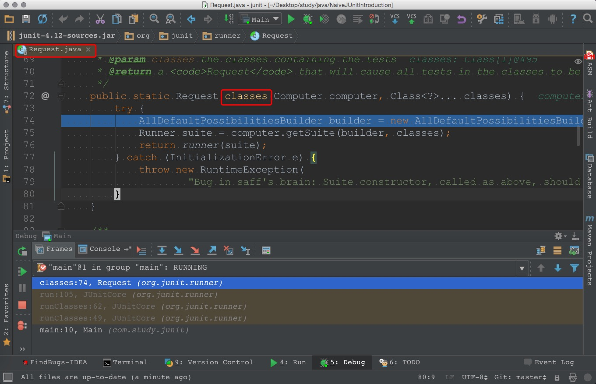
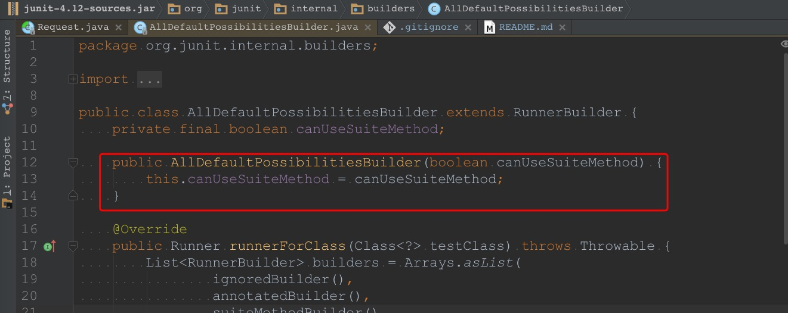
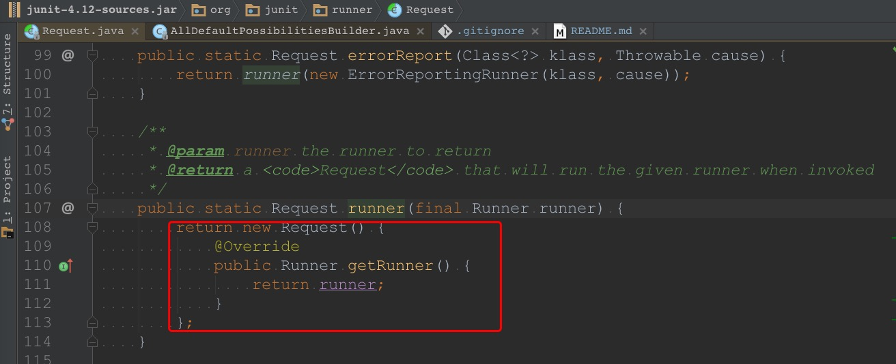
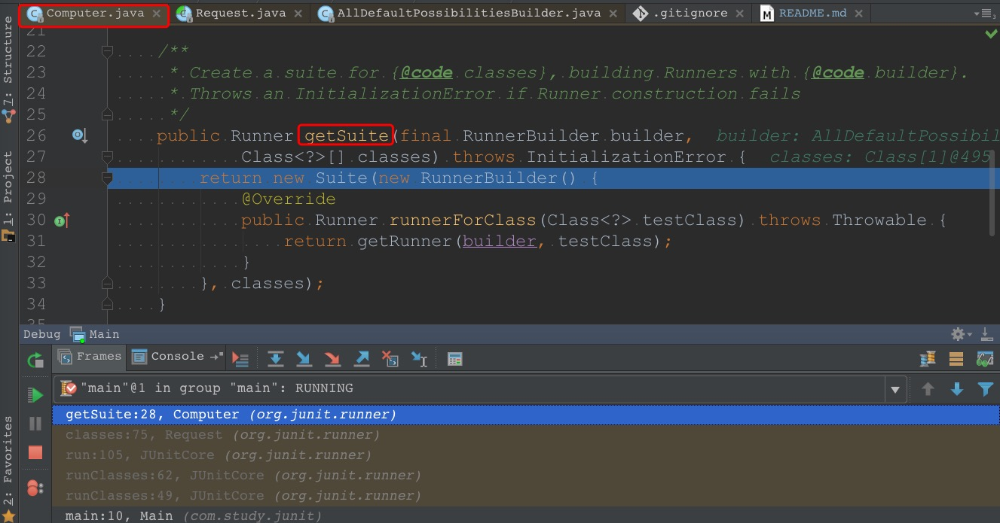
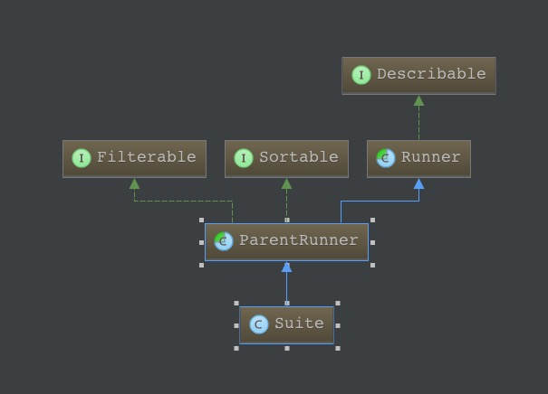
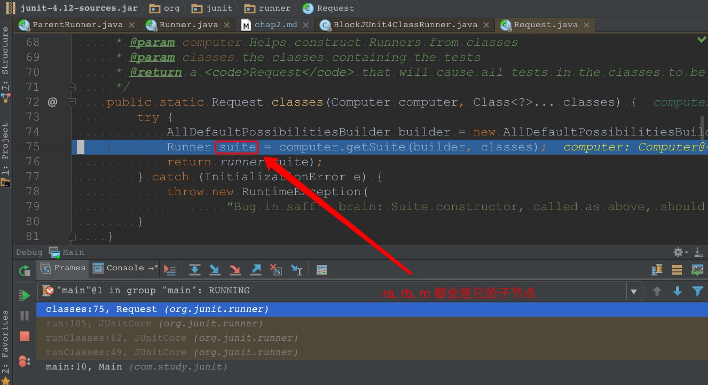

[第一回 初窥门径](chap1.md)
# 第二回 `Runner`全家桶

本回主要角色介绍
| 名称 | 类型 | 事迹 |
|----------|:-------------:|:------|
| **万大侠** | `AllDefaultPossibilitiesBuilder` | `Runner` 的**万**能构建者 |
| **桶大侠** | `Suite` | `Runner` 全家**桶** |


上回说到 `Junit` 里有如下两大步骤
> * 解析要测试的类 
> * 执行测试

这一回我们先看看如何 **解析要测试的类** .
先来到 `Request` 类的 `classes(Computer computer, Class<?>... classes) ` 方法(如下图红框所示)

这个方法里主要做了三件事(具体内容我写在了下面的注释里)
```java
    /**
     * Create a <code>Request</code> that, when processed, will run all the tests
     * in a set of classes.
     *
     * @param computer Helps construct Runners from classes
     * @param classes the classes containing the tests
     * @return a <code>Request</code> that will cause all tests in the classes to be run
     */
    public static Request classes(Computer computer, Class<?>... classes) {
        try {
            // 1. 创建 builder(从名字可以看出来, 后面会出现构建者模式)
            AllDefaultPossibilitiesBuilder builder = new AllDefaultPossibilitiesBuilder(true);
            // 2. 利用 builder 创建一个 Runner 的实例(实例的名称是 suite)
            Runner suite = computer.getSuite(builder, classes);
            // 3. 把第2步生成的 Runner 实例转化为 Request 类型的实例并返回
            return runner(suite);
        } catch (InitializationError e) {
            throw new RuntimeException(
                    "Bug in saff's brain: Suite constructor, called as above, should always complete");
        }
    }
```

由于上述三个步骤中出现的 `builder` 和 `suite` 的戏份比较多,
还是给它们分别起个名字吧
* 将 `builder` 称为 **万能构建者** (因为它在构建 `Runner` 方面确实很在行)
* 将 `suite` 称为 **Runner全家桶** (由于 `suite` 将各个 `Runner` 组合在了一起, 有点像 KFC/麦当劳 的全家桶)

不过感觉名字还是有点长, 
干脆把这个 `builder` 称为 **万大侠**,
把这个 `suite` 称为 **桶大侠** 吧.

第`2`步的逻辑较为复杂,
是这一回的重点.
我们先把第`1`步和第`3`步的逻辑看完,
然后再集中精力看第`2`步.

## 第1步 创建 `builder`
这一步的逻辑比较简单, 
就是创建了一个 `AllDefaultPossibilitiesBuilder` 类的实例(这个类在构建 `Runner` 时功能比较强, 后面会见识到, 这里先不用管)


## 第3步 转化为 `Request` 的实例
这一步通过匿名内部类的方式生成了 `Request` 类的子类的实例(红框里的 `runner` 就是第2步生成的 **桶大侠** `suite`), 
后面在调用这个实例的 `getRunner()` 方法时,
就可以获取到 **桶大侠** 了.
我个人感觉这里的处理有点适配器的意思.


## 第2步 生成 `Runner` 类型的 `suite`
这一步调用了 `Computer` 类的 `getSuite(final RunnerBuilder builder, Class<?>[] classes)` 方法(逻辑如下图)

其逻辑是: 通过调用 `Suite` 的构造函数来生成 `Suite` 类的实例.
这里的细节逻辑还是挺复杂的, 
先介绍一下它的整体思路(只是我个人的理解),
然后再去看细节.

`JUnit` 中有几个比较重要的类(可以参看 [参考文章[1]](https://blog.saymagic.cn/android/2016/09/30/understand-Junit.html) 的相关描述),
我们先看三个
1. `Runner`
2. `ParentRunner`
3. `Suite`




`Runner` 是一个抽象类,
其 `Javadoc` 中提到
> A `Runner` runs tests and notifies a {@link org.junit.runner.notification.RunNotifier}
> of significant events as it does so.

* `Runner` 类负责运行测试并发送通知
* `ParentRunner` 是 `Runner` 的子类, `ParentRunner` 有子节点
* `Suite` 类是 `ParentRunner` 的子类, `Suite` 类是一个测试套件(可以看成 **Runner** 的全家桶)

`Suite` 可以把若干个 `Runner` 打包成一个测试套件, 
而 `Suite` 自己也是 `Runner`,
所以这里用到了 **组合模式**

生活中也有一些事物是这种(与 `Runner-Suite` 类似的)组合关系
* **考试**
期末考试既是考试, 也是考试的组合(或许可以称为 `suite of exams`)
* **景点** 
大的景点经常会包含小景点.
所以大的景点本身是一个景点,
同时它也是景点的组合(比如西湖景点和具体的西湖十景就是这种关系).
* **书** 
丛书也是书.
二十四史是史书的组合,
我们也可以把二十四史看做一部大书
* **部门(或组织架构)** 
一个大部门下常常会有子部门,
所以大部门也可以看成部门的组合.
这里可以稍微拓展一下,
其实很多组织架构都有这种组合关系.
以党组织为例,一个比较大的支部可以看成是支部的组合.
* **行政区划**
大的行政区划可以看成是小的行政区划的组合
(国家可以是省的组合, 省可以是市的组合, 市可以是区县的组合)

回到正题来,假如我们希望对 `A` `B` `C` 三个普通的类进行单元测试,
那么可以用如下的代码
```java
JUnitCore.runClasses(A.class, B.class, C.class);
```

当运行到下图中的`75`行时,
`A` `B` `C` 三个类会被转化为对应的测试类(暂且称为 `ra`, `rb`, `rc` 吧),
`ra` `rb` `rc` 都会是 **桶大侠**`suite` 的子节点.


不过具体是如何构造出这个 **桶大侠** 的呢,
且听[下回](chap3.md)分解

[第三回 五兄弟同心造`Runner`](chap3.md)
