[第二回 组合模式](chap2.md)
# 第三回 构建者(`builder`)模式

本回主要角色介绍
| 名称   |      类型      |  事迹 |
|----------|:-------------:|------:|
| **匿大侠** |  `Suite` 的子类 | 作用像是万大侠的静态代理 |
| **万大侠** |  `AllDefaultPossibilitiesBuilder`   | 构建 `Runner` 的高手 |
| **桶大侠** |  `Suite`   | `Runner` 全家桶 |
| **五大侠** |  `JUnit4Builder`   | 协助 **万大侠** 构建 `Runner` 时, 总是第五个出场|


上回说到通过调用 `Suite` 类的构造函数, 
我们就会得到 **桶大侠**.
但是还没有说到其中的细节.

我们再看一下 **桶大侠** 是如何登场的

其实就是调用 `Suite` 类中的构造函数,
具体来说, 是 `Suite(RunnerBuilder builder, Class<?>[] classes)` 这个构造函数(简称为构造函数`1`).
构造函数`1`里有如下两个参数
* `RunnerBuilder` 类型的 `builder`
* `Class<?>[]` 类型的 `classes`

我们再看一下上面的这张图, 在调用构造函数`1`时, 需要提供 `builder` 参数和 `classes` 参数.
就 **桶大侠** 登场这个场景而言,
构造函数`1`里的 `builder` 参数是通过匿名内部类方式创建的 `RunnerBuilder` 的子类的实例.
构造函数`1`里的 `classes` 参数和我们一开始在 `main` 函数里填写的测试类对应.

这个匿名内部类在本回中还会再出现, 为了便于称呼, 就叫它 **匿大侠** 吧.
**匿大侠** 戏份比较少, 主要还是靠 **万大侠** 来干活(**匿大侠** 有点像是 **桶大侠** 的 *静态代理* ).
注意: **匿大侠**  是 `RunnerBuilder` 的子类的实例,
**万大侠** 是 `AllDefaultPossibilitiesBuilder` 的实例,
所以 **匿大侠** 和 **万大侠** 都是 `RunnerBuilder` 类型的.

**万大侠** 是如何依附在 **匿大侠** 这里的呢? 可以参考下图.
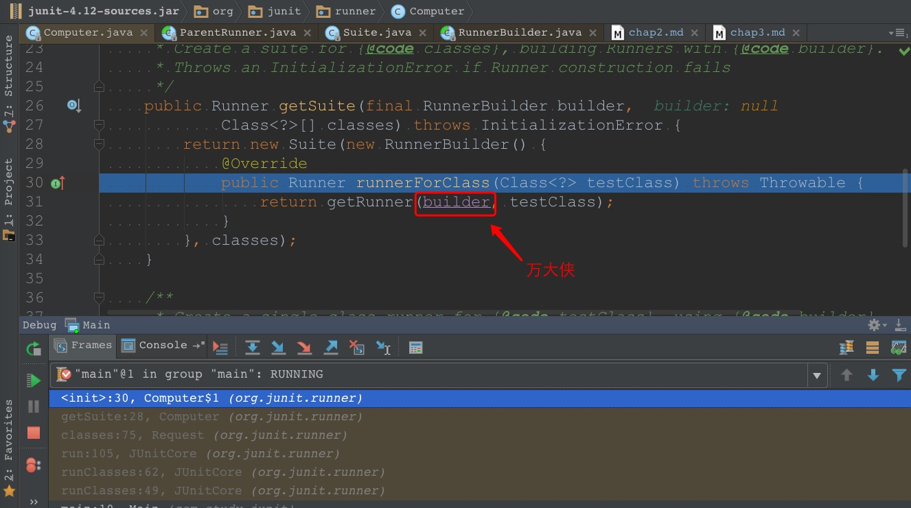

我们看看构造函数`1`内部的逻辑
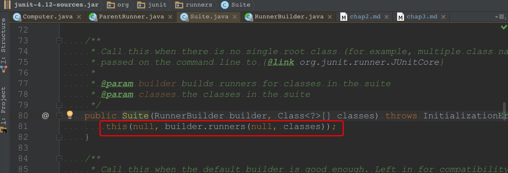
看起来不复杂, 就两件事
1. 执行 `builder.runners(null, classes)`
2. 调用了另一个构造函数(简称为构造函数`2`)

第`1`步中的主要逻辑是 **万大侠** 把 `classes` 转化为 `List<Runner>`.
里面的逻辑还挺多的, 我们一会儿拐回来看里面的逻辑.
第`2`步的逻辑比较简单, 先把它解决掉.
构造函数`2`里的逻辑如下图
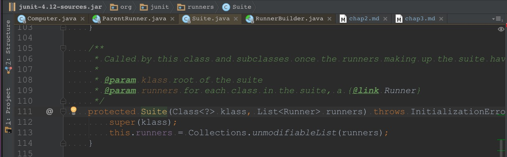
构造函数`2`里做了两件事
* 调用父类(即 `ParentRunner`)的构造函数
* 把 `runners` 包装一下, 然后赋给 `this.runners`(直白一点说, 就是把 `runners` 作为子节点保存下来, **桶大侠** 在这一步认领了若干个子节点)

构造函数`2`的逻辑看完了, 我们还回到构造函数`1`的第`1`步,
看看 **万大侠** 是如何干活的.
第`1`步既然是执行 `builder.runners(null, classes)`,
那我们就看一看这里的逻辑如何.
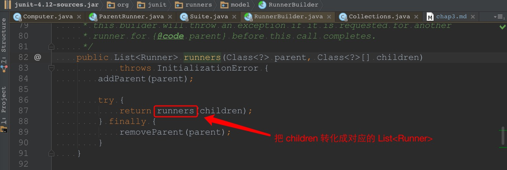
这里面有三步
1. `addParent(parent)`
2. `runners(children)`
3. `removeParent(parent)`

看起来中间那一步比较核心(我不清楚第`1`步和第`3`步的作用, 但是看下来应该不是核心流程),
那就看第`2`步的逻辑吧
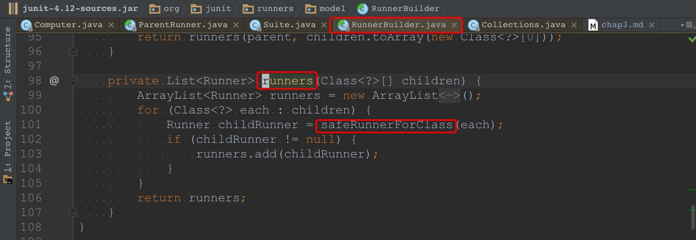
哈哈, 这里的逻辑看起来不复杂.
主逻辑是一个 `for` 循环, 
`for` 循环每运行一次, 
`children` 中就有一个元素被转化为 `Runner` 的实例 `childRunner`.
这些 `childRunner` 会被收集到一个名为 `runners` 的 `List` 里.

所以这里的关键点就是那个转化逻辑了.
转化逻辑是通过 `safeRunnerForClass(Class<?> testClass)` 完成的.
那就看看里面发生了什么吧.
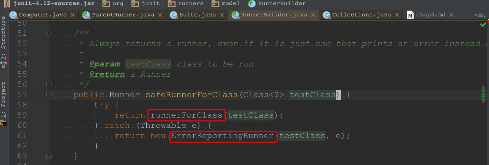
看起来是保证将入参 `testClass` 转化为一个 `Runner`, 方法名的字面意思也是如此.
我们抓住主要矛盾, `catch` 语句块里的逻辑本文就不管了, 
我们看一看 `runnerForClass(testClass)` 里做了什么.
如果是打断点运行到这里, 就会发现现在会跳回下图的位置
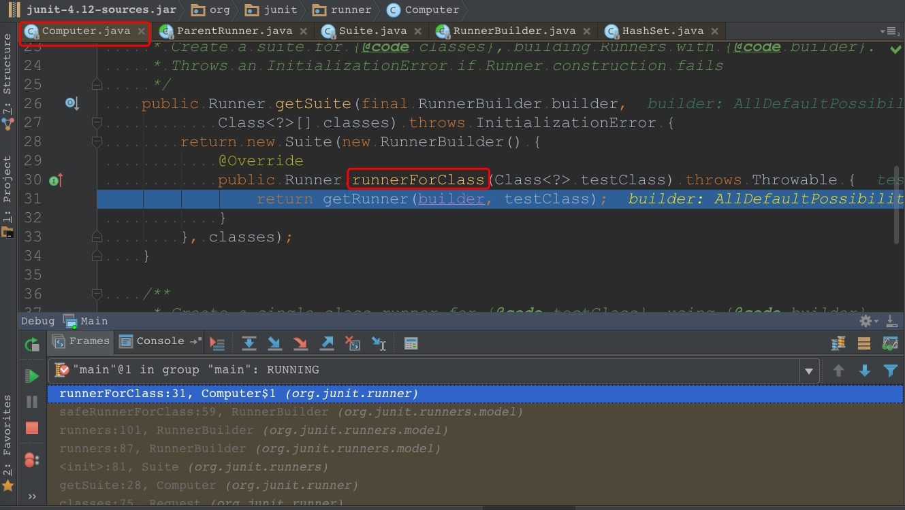
本回中 **匿大侠** 已经出现过了, 这里又是 **匿大侠** 表现的时候.
**匿大侠** `Override` 了 `runnerForClass(Class<?> testClass)` 方法.
其逻辑只有如下一行
```java
return getRunner(builder, testClass);
```
话休絮烦, 我们打断点看 `getRunner(builder, testClass)` 里的逻辑,
经过几次简单的跳转之后, 
就到了 `AllDefaultPossibilitiesBuilder` 类的 `runnerForClass(Class<?> testClass)` 方法里.
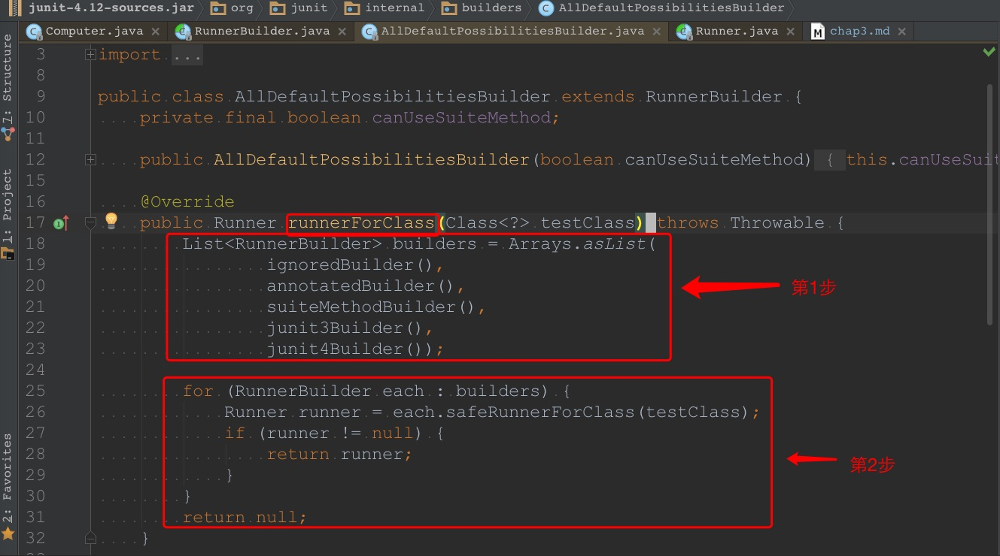
现在是 **万大侠** 的时间.
参考上图, 我们会发现 **万大侠** 的 `runnerForClass(Class<?> testClass)` 函数里,
做了两件事情
1. 找了`5`个 `RunnerBuilder` 来构成 `List`
2. `5`个 `RunnerBuilder` 轮流生成 `Runner`, 当出现第一个不为 `null` 的 `Runner` 时, 直接返回

从第`1`步来看, **万大侠** 手下还有`5`个帮手.
由于这`5`个帮手都是 `RunnerBuilder` 类型的, 
所以这`5`个帮手都能执行 `runnerForClass(Class<?> testClass)` 方法.

为了不脱离主线逻辑,
这里只简单介绍一下,
1. 第一个帮手的类型为 `IgnoredBuilder`, 
其 `runnerForClass(Class<?> testClass)` 方法的内容如下图
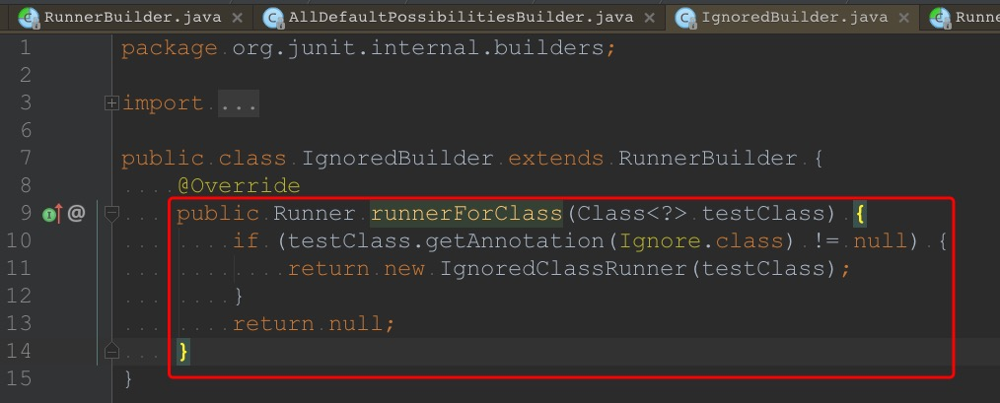
可见只有当测试类上带有 `@Ignore` 注解时, 返回值才不是 `null`.
2. 第二个帮手类型为 `AnnotatedBuilder`, 
其 `runnerForClass(Class<?> testClass)` 方法的内容如下图
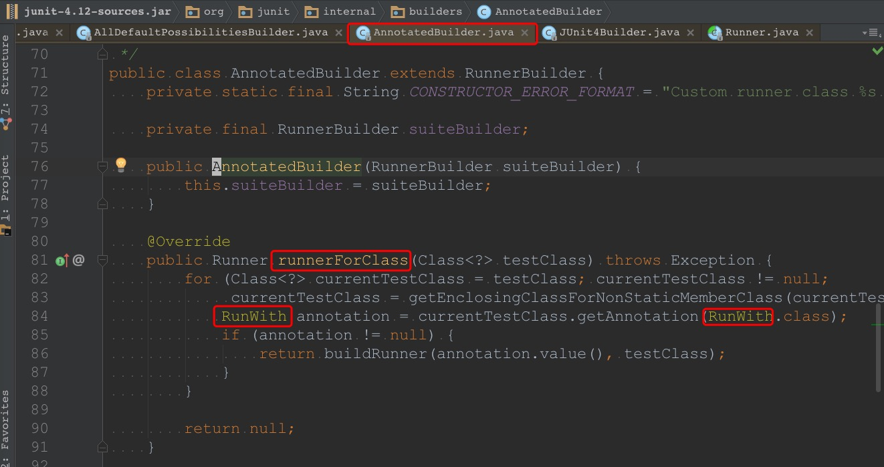
可见这个帮手会处理测试类带有 `@RunWith` 注解的情形(这里不展开细节)
3. 第三个帮手的代码我没研究, 这里跳过
4. 第四个帮手的代码我没研究, 这里跳过
5. 第五个帮手类型为 `JUnit4Builder`, 
其 `runnerForClass(Class<?> testClass)` 方法的内容如下图
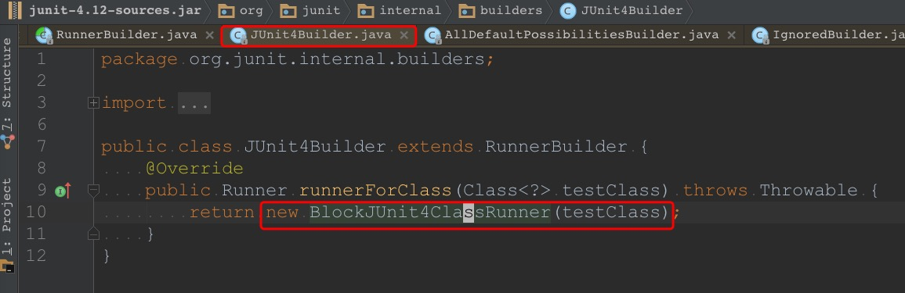
第五个帮手在其 `runnerForClass(Class<?> testClass)` 方法里直接 `new` 了一个 `Runner`, 
可见轮到第五个帮手出场时, 
它一定能把 `testClass` 参数转化为 `Runner`,
这家伙这么出色, 
还是给它起个名字吧.
它总是第五个出手,
叫它 **五大侠** 好了.
这五个帮手一起帮助 **万大侠** 生成 `Runner`,
这里有 *策略模式* 的思想.

我把 [README.md](README.md) 中提到的 `main` 函数在这里再贴一下
```java
public static void main(String[] args) {
  Result result = JUnitCore.runClasses(NaiveTest.class);
  for (Failure failure : result.getFailures()) {
    System.out.println(failure);
  }
}
```
当这个 `main` 函数执行时,
`NaiveTest` 这个测试类最终会被第五个帮手处理(`NaiveTest` 会被第五个帮手被转化成一个 `Runner`)

在这一回里, 
我们看到了 **桶大侠** 在五个帮手的协助下, 
成功将 `Class<?>` 类型的 `testClass` 转化成了 `Runner`.
值得一提的是第五个帮手,
在前四个帮手都处理不了的情况下, 
第五个帮手(也就是 **五大侠**)总是能返回一个非 `null` 的 `Runner`,
不愧是最终的王牌角色.


我们简单回顾一下本回的主要角色.
**匿大侠** 像是 **万大侠** 的静态代理,
**匿大侠** 自己没做什么事, 重要的逻辑都交给 **万大侠** 了.
**万大侠** 有五个帮手,
前四个帮手暂时戏份较少, 
第五个帮手(**五大侠**)总是能不辱使命(实际上五个帮手作用不同, 没有高下之分).

欲知 **五大侠** 具体是如何完成任务的, 
且听[下回](chap4.md)分解

[第四回](chap4.md)