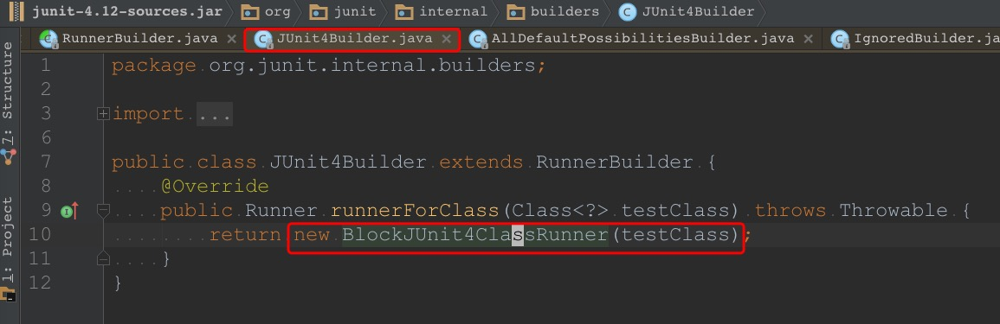

[第三回 五兄弟同心造`Runner`](chap3.md)

# 第四回 布大侠和泰大侠

本回主要角色介绍
| 名称   |      类型      |  事迹 |
|----------|:-------------:|------:|
| **布大侠** |  `BlockJUnit4ClassRunner` | 可以生成 `Runner` |
| **泰大侠** |  `TestClass`   | 将测试类的信息进行解析和整合, 供 `JUnit` 的其他类使用 |

上回说到 **五兄弟** 中的 **老五** 在登场后, 
总能将 `Class<?>` 类型的 `testClass` 转化成 `Runner`,
说得直白一点就是 **老五** 会把程序员写的测试类转化为 `JUnit` 可以直接操作的类(即 `Runner`).
我们在 [第一回](chap1.md) 里提到过
> 可以猜测一下 `JUnit` 运作的原理应该是先解析要测试的类,然后再执行测试.

其实 [第二回](chap2.md) 和 [第三回](chap3.md) 都是铺垫,
本回才是真正进行解析工作.

[第三回](chap3.md) 提到过 **老五** 生成 `Runner` 的逻辑(如下图).

其实就是 `new` 了一个 `BlockJUnit4ClassRunner` 类的实例.

这个 `BlockJUnit4ClassRunner` 是什么来头呢?

看来和 `Suite` 有点像.
`Suite` 是 `ParentRunner` 的子类,
`BlockJUnit4ClassRunner` 也是 `ParentRunner<FrameworkMethod>` 的子类.
不过 `Suite` 是 `Runner` 的全家桶,
而 `BlockJUnit4ClassRunner` 则是测试方法的全家桶.

既然 **老五** 会生成 **BlockJUnit4ClassRunner** 类的实例,
而这个实例又有不少戏份,
按照惯例,
还是给它起个名字吧,
这次用谐音吧,
称它为 **布大侠** 好了.
那么 **老五** 会 `new` 出 **布大侠**.

下面我们开始研究 **布大侠** 的行为.
既然是被 `new` 出来的,
那就顺着这个构造函数看吧.

看来逻辑也不复杂,
就是调用父类(`ParentRunner`)的构造函数而已.

那就接着前往 `ParentRunner` 的构造函数吧.

这次看起来内容多一些,
具体是以下两步
1. 将 `Class<?>` 类型的 `testClass` 转化为 `TestClass` 类型的变量, 并赋给 `this.testClass`
2. 进行校验工作

两步的逻辑都不少,
那就顺着看吧.

先看第`1`步.
第`1`步主要逻辑是创建 `TestClass` 类型的实例(赋值给 `this.testClass` 的逻辑比较简单, 就略过了).

看一下 `createTestClass(Class<?> testClass)` 的逻辑.
就一行
```java
return new TestClass(testClass);
```
所以继续看 `TestClass` 的这个构造函数.

这个构造函数有十几行代码,
看来还是做了不少事情的.

先看看它的 `Javadoc`(虽然截图里也能看到, 不过我还是把文字版的贴一下吧)
> Creates a `TestClass` wrapping `clazz`. Each time this
> constructor executes, the class is scanned for annotations, which can be
> an expensive process (we hope in future JDK's it will not be.) Therefore,
> try to share instances of `TestClass` where possible.

我的理解是 `Class<?>` 类型的 `clazz` 可以(间接)提供测试类的各种信息(哪些方法加了注解,加了什么注解).
但是这些信息 `JUnit` 用起来不方便, 
所以需要把这些信息整合一下, 
方便后续使用.

这个构造函数里就是在做各种信息解析与整合的工作.
`TestClass` 里逻辑挺多的,
且又比较重要,
我们还是先起名字,
继续用谐音的方式吧,
叫它 **泰大侠** 好了.


**泰大侠** 做的事情可以分成以下`5`步
1. 将入参 `clazz` 赋值给 `this.clazz`(上图`46`行)
2. 如果 `clazz` 不是 `null` 的话, 则必须刚好有`1`个构造函数(上图`47`行至`50`行)
3. `new` 两个 `Map`, 在第`4`步会用到(上图`52`行至`55`行)
4. 解析 `clazz` 中的信息, 并将相关信息保存在第`3`步生成的 `Map`中(上图`57`行)
5. 将第`4`步的处理结果包装一下, 保存在对应的数据成员里(上图`59`行和`60`行)

上面五个步骤里, 
第`4`步的逻辑最多, 
我们着重看一下.
其他四个步骤的逻辑都不复杂, 
就略过了.


